# Matrices in size band 1 to 16

Source data: [`16bit.yaml`](16bit.yaml).

Entry count: 36.

| Key | Preview | Shape | Year | Properties | Origin |
|:----|:-------:|:-----:|:----:|:-----------|:-------|
| **AETHER.MB** AETHER, M_b | 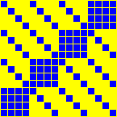 | 16 x 16 | 2025 | involution, symmetric, order = 2 | [link](https://tches.iacr.org/index.php/TCHES/article/view/12228) |
| **ARIA** ARIA | 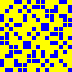 | 16 x 16 | 2003 | involution, symmetric, order = 2 | [link](https://link.springer.com/chapter/10.1007/978-3-540-24691-6_32) |
| **BKL16.S16** Beierle-Kranz-Leander, 4 × 4 over GF(2⁴) aka `C_BeiKraLea16_4x4` | 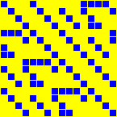 | 16 x 16 | 2016 | order = 20 | [link](https://eprint.iacr.org/2016/119) |
| **CHAM.RF1** CHAM, round function, variant 1 | 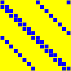 | 16 x 16 | 2017 | order = 16 | [link](https://link.springer.com/chapter/10.1007/978-3-319-78556-1_1) |
| **CHAM.RF2** CHAM, round function, variant 2 | 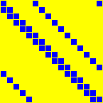 | 16 x 16 | 2017 | order = 8 | [link](https://link.springer.com/chapter/10.1007/978-3-319-78556-1_1) |
| **DL18C** Duval-Leurent, 4 × 4 over GF(2⁴) | 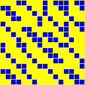 | 16 x 16 | 2018 | order = 60 | [link](https://eprint.iacr.org/2018/260) |
| **GF16.ECCSQR** GF(2¹⁶), squaring, elliptic-curve representation aka `GF16ECCSQR` | 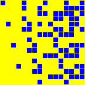 | 16 x 16 | 2023 | order = 8 | [link](https://github.com/starj1023/Binary_ECC) |
| **GF16.SQR** GF(2¹⁶), squaring | 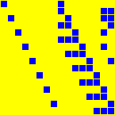 | 16 x 16 | 1998 | order = 16 | [link](https://www.hpl.hp.com/techreports/98/HPL-98-135.pdf) |
| **GF4.SQR** GF(2⁴), squaring |  | 4 x 4 | 1998 | order = 4 | [link](https://www.hpl.hp.com/techreports/98/HPL-98-135.pdf) |
| **GF8.ECCSQR** GF(2⁸), squaring, elliptic-curve representation aka `GF8ECCSQR` | 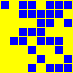 | 8 x 8 | 2023 | order = 4 | [link](https://github.com/starj1023/Binary_ECC) |
| **GF8.SQR** GF(2⁸), squaring | 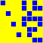 | 8 x 8 | 2001 | order = 8 | [link](https://nvlpubs.nist.gov/nistpubs/FIPS/NIST.FIPS.197-upd1.pdf) |
| **JOLTIK** Joltik aka `SKOP15.IS16` | 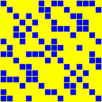 | 16 x 16 | 2014 | involution, order = 2 | [link](https://competitions.cr.yp.to/round1/joltikv11.pdf) |
| **JPST17.IS16** Jean-Peyrin-Sim-Tourteaux, M₄,ᵢ,₄ aka `BEANIE.MIXCOLUMNS`, `M_{4,i,4}`, `ePrint_JeaPeySim_i_4x4_4`, `ePrint_JeaPeySim_i_4x4_8` | 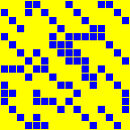 | 16 x 16 | 2017 | involution, order = 2 | [link](https://eprint.iacr.org/2017/101) |
| **JPST17.S16** Jean-Peyrin-Sim-Tourteaux, 4 × 4 over GF(2⁴) aka `ePrint_JeaPeySim_4x4_4`, `ePrint_JeaPeySim_4x4_8` | 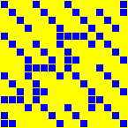 | 16 x 16 | 2017 | order = 4095 | [link](https://eprint.iacr.org/2017/101) |
| **KLSW17.S16** Kranz-Leander-Stoffelen-Wiemer, M, 4 × 4 over GF(2⁴) | 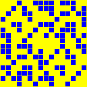 | 16 x 16 | 2017 | order = 12 | [link](https://tosc.iacr.org/index.php/ToSC/article/view/805) |
| **LED.MIXCOLUMN** LED, MixColumnsSerial aka `LED.MIXCOLUMNS` |  | 16 x 16 | 2011 | order = 255 | [link](https://eprint.iacr.org/2012/600) |
| **LED.MIXCOLUMNSERIAL** LED, A aka `LED.MIXCOLUMNSSERIAL` |  | 16 x 16 | 2011 | order = 255 | [link](https://eprint.iacr.org/2012/600) |
| **LS16.S16** Liu-Sim, 4 × 4 over GF(2⁴) aka `FSE_LimSim16`, `FSE_LiuSim16`, `FSE_LimSim16_4x4_4`, `FSE_LiuSim16_8x8_8` | 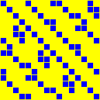 | 16 x 16 | 2016 | order = 60 | [link](https://tosc.iacr.org/index.php/ToSC) |
| **LW16.A16** Li-Wang, 4 × 4 over GF(2⁴), variant A aka `FSE_LiWang16_4x4_4` | 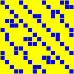 | 16 x 16 | 2016 | order = 60 | [link](https://tosc.iacr.org/index.php/ToSC) |
| **LW16.B16** Li-Wang, 4 × 4 over GF(2⁴), variant B aka `FSE_LiWang16_4x4_4` | 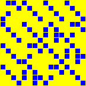 | 16 x 16 | 2016 | order = 255 | [link](https://tosc.iacr.org/index.php/ToSC) |
| **LW16.I16** Li-Wang, involutory 4 × 4 over GF(2⁴) aka `FSE_LiWang16_4x4_4` | 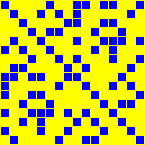 | 16 x 16 | 2016 | involution, order = 2 | [link](https://tosc.iacr.org/index.php/ToSC) |
| **MIDORI** PRIDE, L₀ | 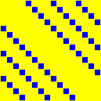 | 16 x 16 | 2014 | involution, symmetric, order = 2 | [link](https://eprint.iacr.org/2014/453) |
| **PRIDE.L0** PRIDE, L₀ |  | 16 x 16 | 2014 | involution, symmetric, order = 2 | [link](https://eprint.iacr.org/2014/453) |
| **PRIDE.L1** PRIDE, L₁ | 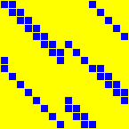 | 16 x 16 | 2014 | order = 16 | [link](https://eprint.iacr.org/2014/453) |
| **PRIDE.L2** PRIDE, L₂ | 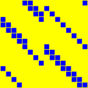 | 16 x 16 | 2014 | order = 16 | [link](https://eprint.iacr.org/2014/453) |
| **PRIDE.L3** PRIDE, L₃ | 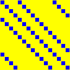 | 16 x 16 | 2014 | involution, symmetric, order = 2 | [link](https://eprint.iacr.org/2014/453) |
| **PRINCE.M0** PRINCE, M₀ aka `M0` | 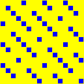 | 16 x 16 | 2012 | involution, symmetric, order = 2 | [link](https://eprint.iacr.org/2012/529) |
| **PRINCE.M1** PRINCE, M₁ aka `M1` | 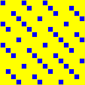 | 16 x 16 | 2012 | involution, symmetric, order = 2 | [link](https://eprint.iacr.org/2012/529) |
| **QARMA.S64** QARMA, QARMA-64 M | 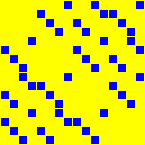 | 16 x 16 | 2017 | involution, order = 2 | [link](https://eprint.iacr.org/2016/444) |
| **SEFA.MDS16** SEFA, MDSLayer, 4 × 4 over GF(2⁴) | 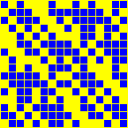 | 16 x 16 | 2026 | order = 30 | [link](https://eprint.iacr.org/2026/897) |
| **SKINNY.MIXCOLUMN** SKINNY, MixColumns aka `SKINNY` | 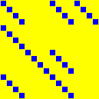 | 16 x 16 | 2016 | order = 4 | [link](https://eprint.iacr.org/2016/660) |
| **SKOP15.S16** Sim-Khoo-Oggier-Peyrin, 4 × 4 over GF(2⁴) aka `FSE_SKOP15_4x4_4`, `FSE_SKOP15_4x4_8` | 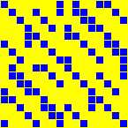 | 16 x 16 | 2015 | order = 30 | [link](https://tosc.iacr.org/) |
| **SMALLSCALEAES** Small Scale AES | 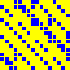 | 16 x 16 | 2005 | order = 4 | [link](https://link.springer.com/chapter/10.1007/11502760_10) |
| **SS16.IS16** Sarkar-Syed, involutory 4 × 4 over GF(2⁴) aka `ToSC_SarSye16_4x4`, `ToSC_SarSye16_i_4x4`, `ToSC_SarSye16_448` | 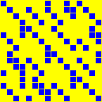 | 16 x 16 | 2016 | involution, order = 2 | [link](https://tosc.iacr.org/index.php/ToSC/article/view/537) |
| **SS16.S16** Sarkar-Syed, 4 × 4 over GF(2⁴) aka `ToSC_SarSye16_4x4`, `ToSC_SarSye16_448` | 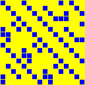 | 16 x 16 | 2016 | order = 60 | [link](https://tosc.iacr.org/index.php/ToSC/article/view/537) |
| **TWINKLE.MIXSLICE** Twinkle, MixSlice | 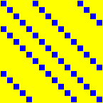 | 16 x 16 | 2024 | order = 16 | [link](https://cic.iacr.org/) |

