# Matrices in size band 17 to 32

Source data: [`32bit.yaml`](32bit.yaml).

Entry count: 47.

| Key | Preview | Shape | Year | Properties | Origin |
|:----|:-------:|:-----:|:----:|:-----------|:-------|
| **AES.MIXCOLUMN** AES, MixColumns | 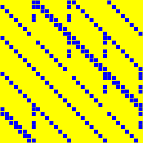 | 32 x 32 | 1998, 2001 | order=4 | [link](https://csrc.nist.gov/projects/cryptographic-standards-and-guidelines/archived-crypto-projects/aes-development) |
| **ANUBIS** Anubis | 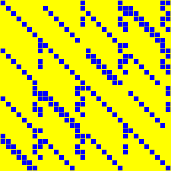 | 32 x 32 | 2000 | involution, order=2 | [link](https://www.cosic.esat.kuleuven.be/nessie/tweaks.html) |
| **BKL16.S32** Beierle-Kranz-Leander, 4 × 4 over GF(2⁸) | 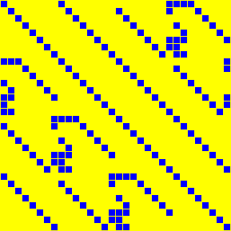 | 32 x 32 | 2016 | order=340 | [link](https://eprint.iacr.org/2016/119) |
| **CHAM.KS1** CHAM, key schedule, variant 1 | 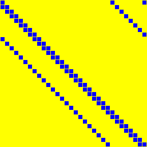 | 32 x 32 | 2017 | order=32 | [link](https://link.springer.com/chapter/10.1007/978-3-319-78556-1_1) |
| **CHAM.KS2** CHAM, key schedule, variant 2 | 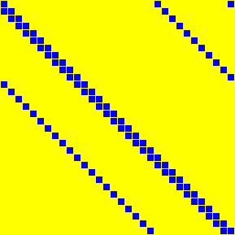 | 32 x 32 | 2017 | order=16 | [link](https://link.springer.com/chapter/10.1007/978-3-319-78556-1_1) |
| **CLEFIA.M0** CLEFIA, M₀ aka `Anubis MixColumns (NIST Circuit Complexity)` |  | 32 x 32 | 2007 | involution, order=2 | [link](https://www.sony.net/Products/cryptography/clefia/) |
| **CLEFIA.M1** CLEFIA, M₁ | 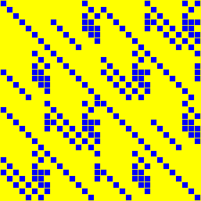 | 32 x 32 | 2007 | involution, order=2 | [link](https://www.sony.net/Products/cryptography/clefia/) |
| **DIALGA** Dialga, MatrixMul | 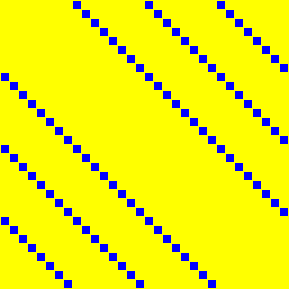 | 32 x 32 | 2025 | involution, symmetric, order=2 | [link](https://tosc.iacr.org/index.php/ToSC) |
| **DL18A** Duval-Leurent, M⁸,³₄,₆ | 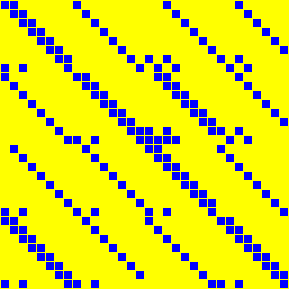 | 32 x 32 | 2018 | order=120 | [link](https://eprint.iacr.org/2018/260) |
| **DL18B** Duval-Leurent, 4 × 4 over GF(2⁸), depth 3 | 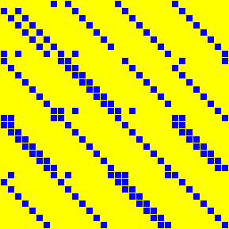 | 32 x 32 | 2018 | - | [link](https://eprint.iacr.org/2018/260) |
| **FOX.MU4** FOX, μ₄ | 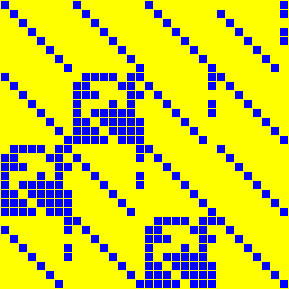 | 32 x 32 | 2003 | order=65535 | [link](https://link.springer.com/chapter/10.1007/978-3-540-30564-4_8) |
| **GF32.SQR** GF(2³²), squaring | 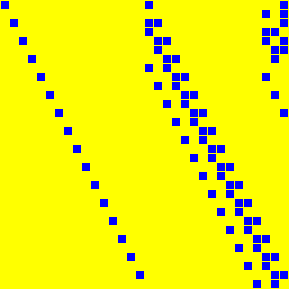 | 32 x 32 | 1998 | order=32 | [link](https://www.hpl.hp.com/techreports/98/HPL-98-135.pdf) |
| **ICEPOLE.SLICE** ICEPOLE, slice mixer | 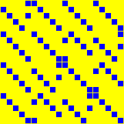 | 20 x 20 | 2014, 2020 | order=1023 | [link](https://eprint.iacr.org/2020/1296) |
| **JPST17.IS32** Jean-Peyrin-Sim-Tourteaux, M₄,ᵢ,₈ | 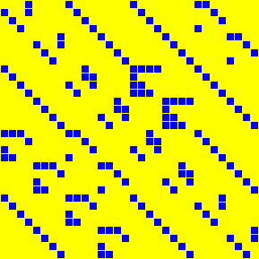 | 32 x 32 | 2017 | involution, order=2 | [link](https://eprint.iacr.org/2017/101) |
| **JPST17.S32** Jean-Peyrin-Sim-Tourteaux, 4 × 4 over GF(2⁸) | 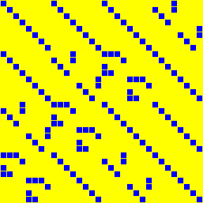 | 32 x 32 | 2017 | order=4095 | [link](https://eprint.iacr.org/2017/101) |
| **KLSW17.IS32** Kranz-Leander-Stoffelen-Wiemer, M⁻¹, 4 × 4 over GF(2⁸) | 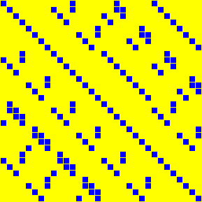 | 32 x 32 | 2017 | involution, order=2 | [link](https://tosc.iacr.org/index.php/ToSC/article/view/805) |
| **KLSW17.IS8_32** Kranz-Leander-Stoffelen-Wiemer, M⁻¹, 8 × 8 over GF(2⁴) | 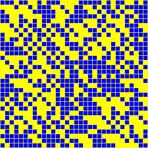 | 32 x 32 | 2017 | involution, order=2 | [link](https://tosc.iacr.org/index.php/ToSC/article/view/805) |
| **KLSW17.S32** Kranz-Leander-Stoffelen-Wiemer, M, 4 × 4 over GF(2⁸) | 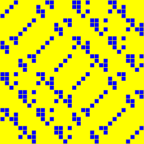 | 32 x 32 | 2017 | order=12 | [link](https://tosc.iacr.org/index.php/ToSC/article/view/805) |
| **KLSW17.S8_32** Kranz-Leander-Stoffelen-Wiemer, M, 8 × 8 over GF(2⁴) |  | 32 x 32 | 2017 | order=131070 | [link](https://tosc.iacr.org/index.php/ToSC/article/view/805) |
| **LS16.S32** Liu-Sim, 4 × 4 over GF(2⁸) | 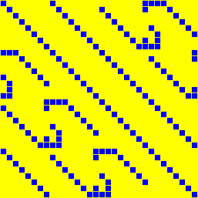 | 32 x 32 | 2016 | order=20 | [link](https://tosc.iacr.org/index.php/ToSC) |
| **LW16.A32** Li-Wang, 4 × 4 over GF(2⁸), variant A | 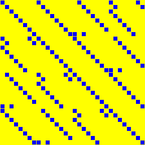 | 32 x 32 | 2016 | order=20 | [link](https://tosc.iacr.org/index.php/ToSC) |
| **LW16.B32** Li-Wang, 4 × 4 over GF(2⁸), variant B | 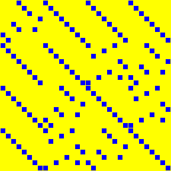 | 32 x 32 | 2016 | order=510 | [link](https://tosc.iacr.org/index.php/ToSC) |
| **LW16.IA32** Li-Wang, involutory 4 × 4 over GF(2⁸), variant A | 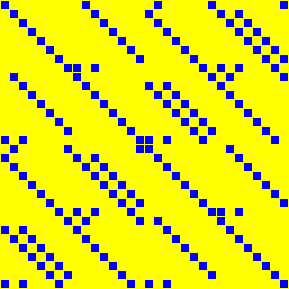 | 32 x 32 | 2016 | involution, order=2 | [link](https://tosc.iacr.org/index.php/ToSC) |
| **LW16.IB32** Li-Wang, involutory 4 × 4 over GF(2⁸), variant B | 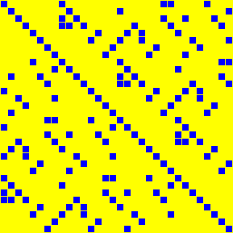 | 32 x 32 | 2016 | involution, order=2 | [link](https://tosc.iacr.org/index.php/ToSC) |
| **PYJAMASK.M0** Pyjamask, M₀ | 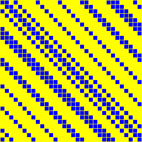 | 32 x 32 | 2019 | order=32 | [link](https://csrc.nist.gov/projects/lightweight-cryptography) |
| **PYJAMASK.M1** Pyjamask, M₁ | 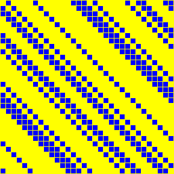 | 32 x 32 | 2019 | order=32 | [link](https://csrc.nist.gov/projects/lightweight-cryptography) |
| **PYJAMASK.M2** Pyjamask, M₂ | 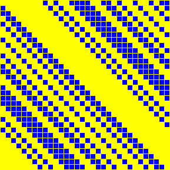 | 32 x 32 | 2019 | order=32 | [link](https://csrc.nist.gov/projects/lightweight-cryptography) |
| **PYJAMASK.M3** Pyjamask, M₃ | 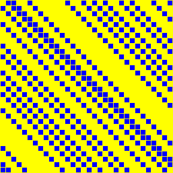 | 32 x 32 | 2019 | order=16 | [link](https://csrc.nist.gov/projects/lightweight-cryptography) |
| **PYJAMASK.MK** Pyjamask, Mₖ | 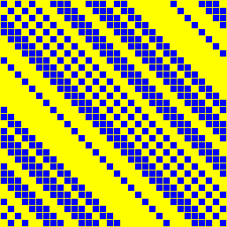 | 32 x 32 | 2019 | order=32 | [link](https://csrc.nist.gov/projects/lightweight-cryptography) |
| **QARMA.S128** QARMA, QARMA-128 M | 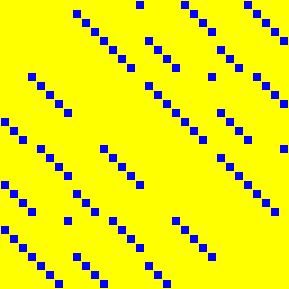 | 32 x 32 | 2017 | involution, order=2 | [link](https://eprint.iacr.org/2016/444) |
| **SHA2.BIGSIGMA0** SHA-2, Σ₀ |  | 32 x 32 | 2001 | order=32 | [link](https://nvlpubs.nist.gov/nistpubs/FIPS/NIST.FIPS.180-4.pdf) |
| **SHA2.BIGSIGMA1** SHA-2, Σ₁ |  | 32 x 32 | 2001 | order=16 | [link](https://nvlpubs.nist.gov/nistpubs/FIPS/NIST.FIPS.180-4.pdf) |
| **SHA2.SMALLSIGMA0** SHA-2, σ₀ | 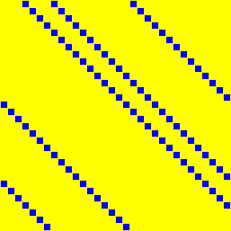 | 32 x 32 | 2001 | order=49146 | [link](https://nvlpubs.nist.gov/nistpubs/FIPS/NIST.FIPS.180-4.pdf) |
| **SHA2.SMALLSIGMA1** SHA-2, σ₁ | 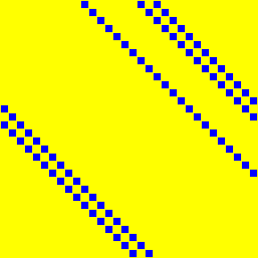 | 32 x 32 | 2001 | order=65534 | [link](https://nvlpubs.nist.gov/nistpubs/FIPS/NIST.FIPS.180-4.pdf) |
| **SKOP15.IS4_32** Sim-Khoo-Oggier-Peyrin, involutory 4 × 4 over GF(2⁸) |  | 32 x 32 | 2015 | involution, order=2 | [link](https://tosc.iacr.org/) |
| **SKOP15.IS8_32** Sim-Khoo-Oggier-Peyrin, involutory 8 × 8 over GF(2⁴) aka `FSE_SKOP15_i_8x8_4` |  | 32 x 32 | 2015 | involution, order=2 | [link](https://tosc.iacr.org/) |
| **SKOP15.S4_32** Sim-Khoo-Oggier-Peyrin, 4 × 4 over GF(2⁸) | 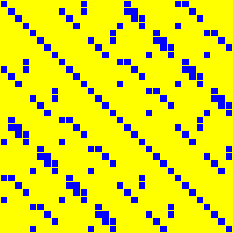 | 32 x 32 | 2015 | order=30 | [link](https://tosc.iacr.org/) |
| **SKOP15.S8_32** Sim-Khoo-Oggier-Peyrin, 8 × 8 over GF(2⁴) aka `FSE_SKOP15_8x8_4` |  | 32 x 32 | 2015 | order=10 | [link](https://tosc.iacr.org/) |
| **SM4** SM4 |  | 32 x 32 | 2003, 2007 | order=16 | [link](https://datatracker.ietf.org/doc/html/rfc8998) |
| **SS16.IS32** Sarkar-Syed, involutory 4 × 4 over GF(2⁸) aka `ToSC_SarSye16_4x4` | 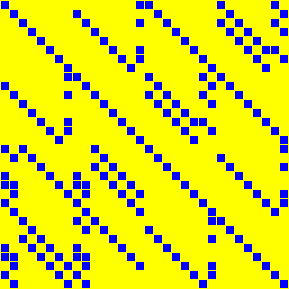 | 32 x 32 | 2016 | involution, order=2 | [link](https://tosc.iacr.org/index.php/ToSC/article/view/537) |
| **SS16.S32** Sarkar-Syed, 4 × 4 over GF(2⁸) aka `ToSC_SarSye16_4x4` | 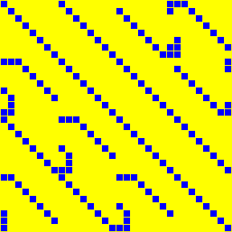 | 32 x 32 | 2016 | order=340 | [link](https://tosc.iacr.org/index.php/ToSC/article/view/537) |
| **SS17.S32** Sarkar-Syed, 8 × 8 over GF(2⁴) | 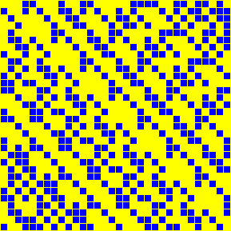 | 32 x 32 | 2017 | order=2730 | [link](https://eprint.iacr.org/2017/368) |
| **TWOFISH** Twofish | 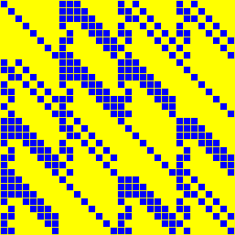 | 32 x 32 | 1998 | order=1431655765 | [link](https://www.schneier.com/academic/twofish/) |
| **WHIRLWIND.M0** Whirlwind, M₀ | 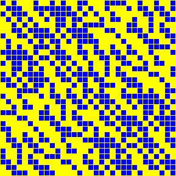 | 32 x 32 | 2010 | order=30 | [link](https://link.springer.com/chapter/10.1007/978-3-642-13858-4_5) |
| **WHIRLWIND.M1** Whirlwind, M₁ | 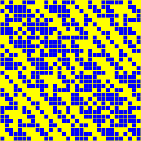 | 32 x 32 | 2010 | order=30 | [link](https://link.springer.com/chapter/10.1007/978-3-642-13858-4_5) |
| **ZUC.L1** SM4 |  | 32 x 32 | 2003, 2007 | order=16 | [link](https://datatracker.ietf.org/doc/html/rfc8998) |
| **ZUC.L2** ZUC, L₂ | 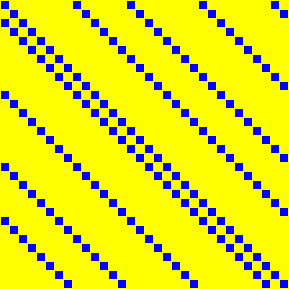 | 32 x 32 | 2011 | order=16 | [link](https://www.gsma.com/aboutus/wp-content/uploads/2014/12/eea3eia3zucv16.pdf) |

