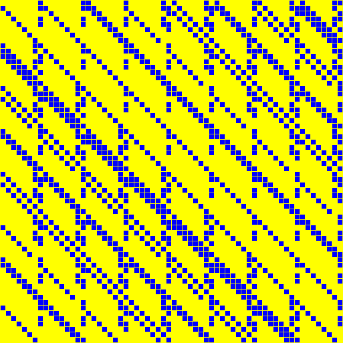
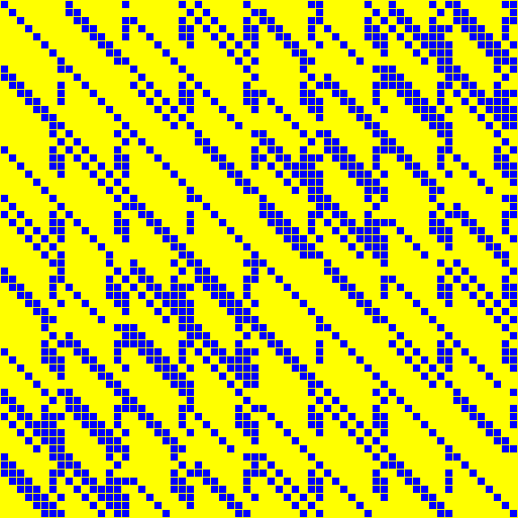
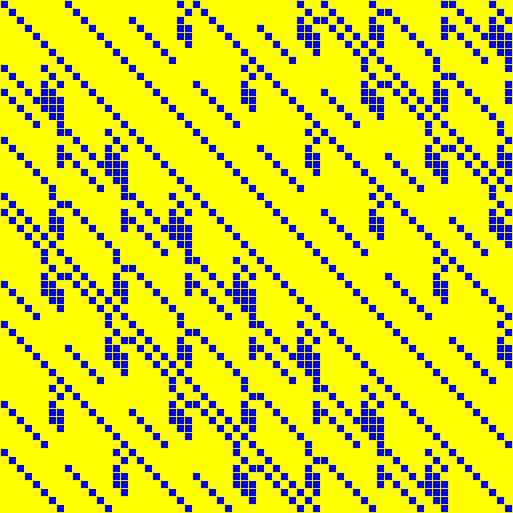

# Matrices in size band 33 to 64

Source data: [`64bit.yaml`](64bit.yaml).

Entry count: 20.

| Key | Preview | Shape | Year | Properties | Origin |
|:----|:-------:|:-----:|:----:|:-----------|:-------|
| **ASCON.SIGMA0** Ascon, Σ₀ |  | 64 x 64 | 2014 | order = 64 | [link](https://ascon.iaik.tugraz.at/) |
| **ASCON.SIGMA1** Ascon, Σ₁ |  | 64 x 64 | 2014 | order = 32 | [link](https://ascon.iaik.tugraz.at/) |
| **ASCON.SIGMA2** Ascon, Σ₂ |  | 64 x 64 | 2014 | order = 64 | [link](https://ascon.iaik.tugraz.at/) |
| **ASCON.SIGMA3** Ascon, Σ₃ |  | 64 x 64 | 2014 | order = 64 | [link](https://ascon.iaik.tugraz.at/) |
| **ASCON.SIGMA4** Ascon, Σ₄ |  | 64 x 64 | 2014 | order = 32 | [link](https://ascon.iaik.tugraz.at/) |
| **BKL16.S64** Beierle-Kranz-Leander, 8 × 8 over GF(2⁸) |  | 64 x 64 | 2016 | order = 2040 | [link](https://eprint.iacr.org/2016/119) |
| **FOX.MU8** FOX, μ₈ |  | 64 x 64 | 2003 | order = 56514897667635 | [link](https://link.springer.com/chapter/10.1007/978-3-540-30564-4_8) |
| **GF64.SQR** GF(2⁶⁴), squaring |  | 64 x 64 | 1998 | order = 64 | [link](https://www.hpl.hp.com/techreports/98/HPL-98-135.pdf) |
| **GROESTL** Grøstl |  | 64 x 64 | 2008 | order = 2040 | [link](http://www.groestl.info/) |
| **JPST17.IS64** Jean-Peyrin-Sim-Tourteaux, involutory 8 × 8 over GF(2⁸) |  | 64 x 64 | 2017 | order = 170 | [link](https://eprint.iacr.org/2017/101) |
| **KHAZAD** KHAZAD |  | 64 x 64 | 2000 | involution, order = 2 | [link](https://www.cosic.esat.kuleuven.be/nessie/tweaks.html) |
| **KLSW17.IS64** Kranz-Leander-Stoffelen-Wiemer, M⁻¹, 8 × 8 over GF(2⁸) |  | 64 x 64 | 2017 | involution, order = 2 | [link](https://tosc.iacr.org/index.php/ToSC/article/view/805) |
| **KLSW17.S64** Kranz-Leander-Stoffelen-Wiemer, M, 8 × 8 over GF(2⁸) |  | 64 x 64 | 2017 | - | [link](https://tosc.iacr.org/index.php/ToSC/article/view/805) |
| **LS16.S64** Liu-Sim, 8 × 8 over GF(2⁸) |  | 64 x 64 | 2016 | order = 2040 | [link](https://tosc.iacr.org/index.php/ToSC) |
| **SCARF.SIGMA** SCARF, Σ |  | 60 x 60 | 2023 | order = 60 | [link](https://www.usenix.org/conference/usenixsecurity23/presentation/canale) |
| **SKOP15.IS64** Sim-Khoo-Oggier-Peyrin, involutory 8 × 8 over GF(2⁸) |  | 64 x 64 | 2015 | involution, order = 2 | [link](https://tosc.iacr.org/) |
| **SKOP15.S64** Sim-Khoo-Oggier-Peyrin, 8 × 8 over GF(2⁸) |  | 64 x 64 | 2015 | order = 510 | [link](https://eprint.iacr.org/2015/258) |
| **SPOOK.LBOX** Spook, Clyde-128 L′ aka `CLYDE.LBOX` |  | 64 x 64 | 2020 | order = 32 | [link](https://tosc.iacr.org/index.php/ToSC/article/view/8623) |
| **SS17.S64** Sarkar-Syed, 8 × 8 over GF(2⁸) aka `ACISP_SarSye17_8x8_4`, `ACISP_SarSye17_8x8_8` |  | 64 x 64 | 2017 | order = 2040 | [link](https://eprint.iacr.org/2017/368) |
| **WHIRLPOOL** Whirlpool |  | 64 x 64 | 2000 | order = 408 | [link](https://web.archive.org/web/20171129084214/http://www.larc.usp.br/~pbarreto/WhirlpoolPage.html) |

