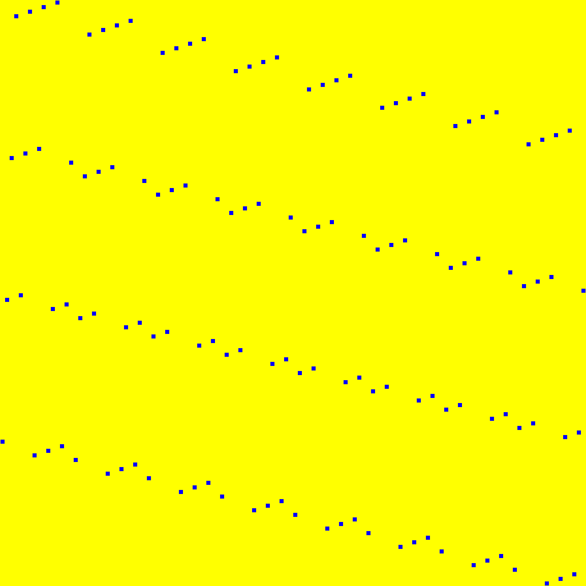
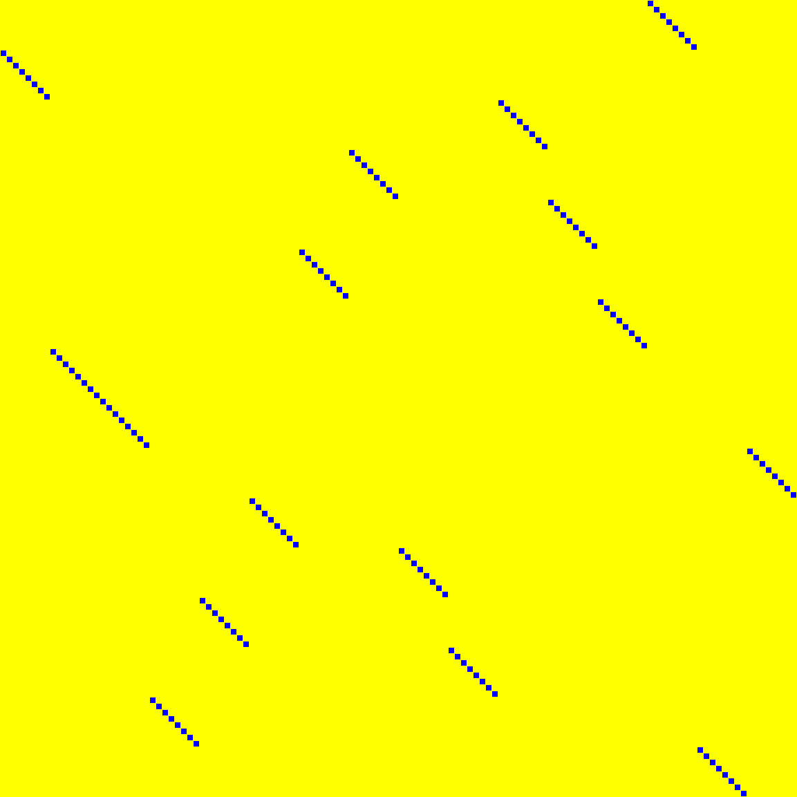
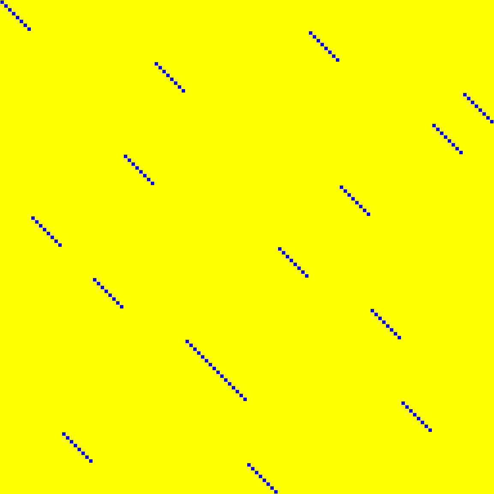
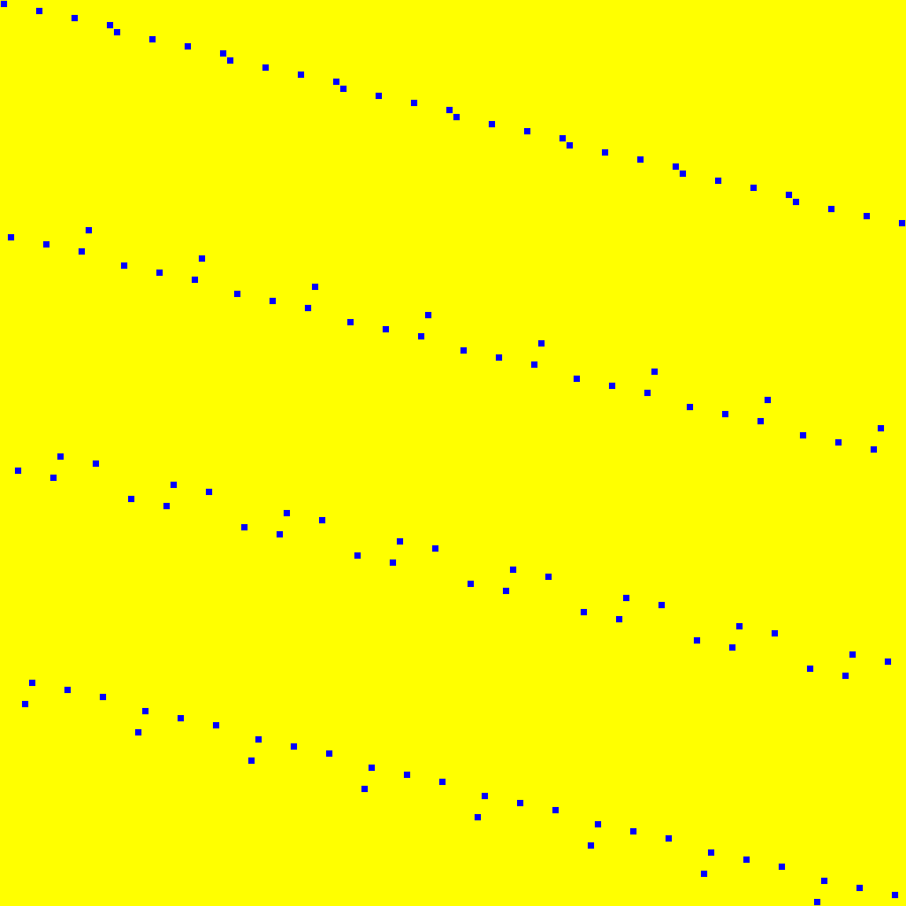
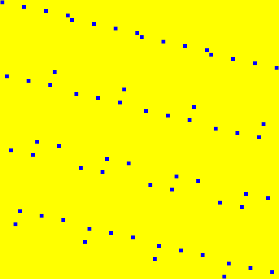
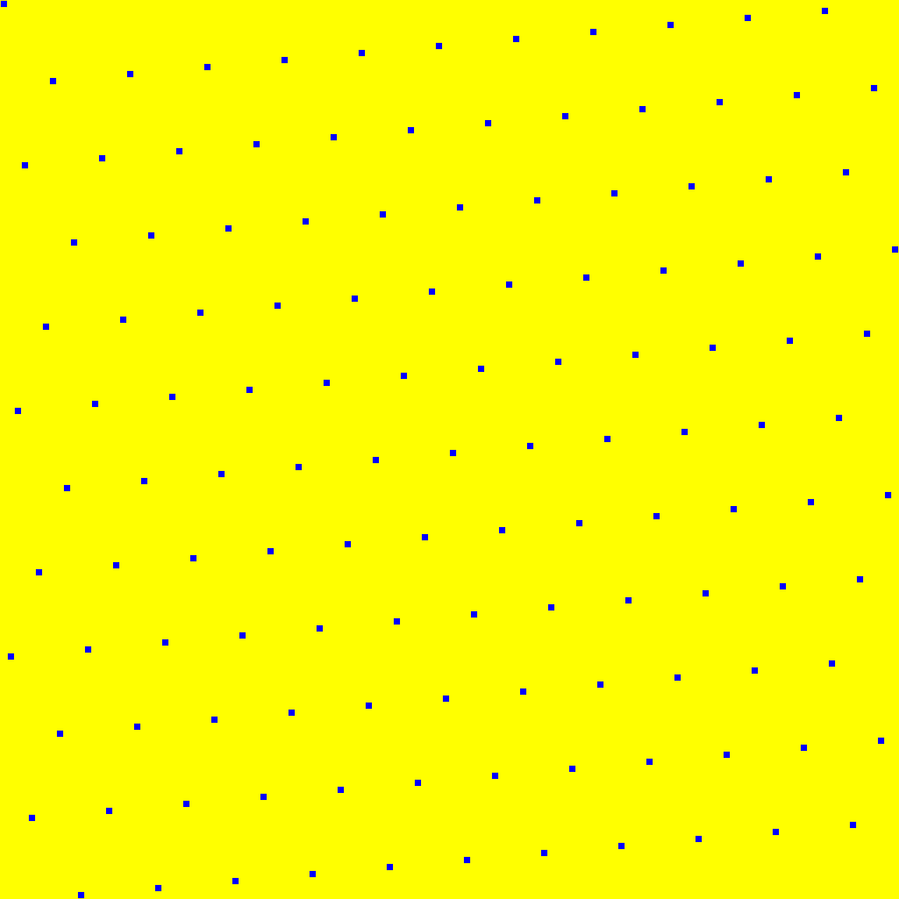
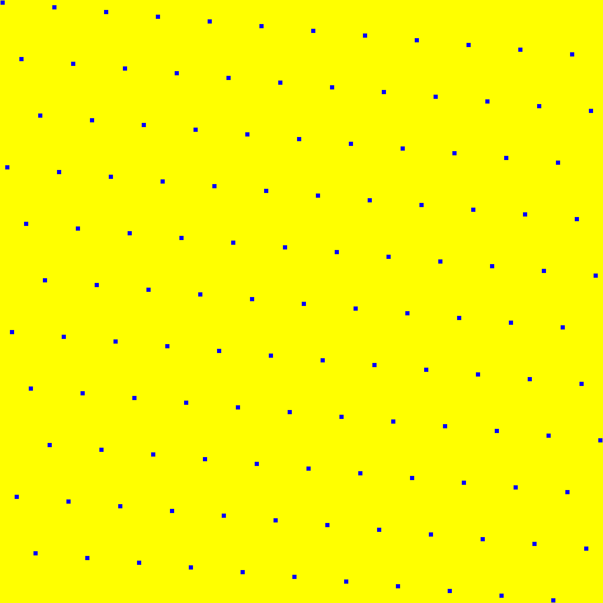
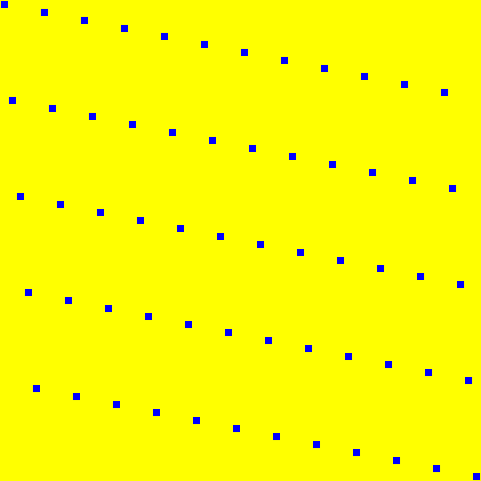

# Bit-permutations

Source data: [`permutations.yaml`](permutations.yaml).

Entry count: 21.

| Key | Preview | Shape | Year | Properties | Origin |
|:----|:-------:|:-----:|:----:|:-----------|:-------|
| **AETHER.PN** AETHER, Pₙ |  | 128 | 2025 | order = 5 | [link](https://tches.iacr.org/index.php/TCHES/article/view/12228) |
| **BAKSHEESH.P** BAKSHEESH, PLayer |  | 128 | 2026 | order = 310 | [link](https://cic.iacr.org/p/2/4/31) |
| **BEANIE.SR** BEANIE, ShiftRows |  | 32 | 2025 | involution, order = 2 | [link](https://tosc.iacr.org/index.php/ToSC) |
| **DIALGA.P0** Dialga, π₀ |  | 128 | 2025 | order = 8 | [link](https://tosc.iacr.org/index.php/ToSC) |
| **DIALGA.P1** Dialga, π₁ |  | 128 | 2025 | order = 8 | [link](https://tosc.iacr.org/index.php/ToSC) |
| **DIALGA.P2** Dialga, π₂ |  | 128 | 2025 | order = 8 | [link](https://tosc.iacr.org/index.php/ToSC) |
| **DIALGA.P3** Dialga, π₃ |  | 128 | 2025 | order = 4 | [link](https://tosc.iacr.org/index.php/ToSC) |
| **DIALGA.PM** Dialga, πₘ |  | 128 | 2025 | order = 4 | [link](https://tosc.iacr.org/index.php/ToSC) |
| **GIFT.128** GIFT, GIFT-128 bit permutation |  | 128 | 2017 | order = 310 | [link](https://eprint.iacr.org/2017/622) |
| **GIFT.64** GIFT, GIFT-64 bit permutation |  | 64 | 2017 | order = 4 | [link](https://eprint.iacr.org/2017/622) |
| **GLEEOK.PI128B1** Gleeok-128, π₁ |  | 128 | 2024 | order = 32 | [link](https://tches.iacr.org/index.php/TCHES) |
| **GLEEOK.PI128B2** Gleeok-128, π₂ |  | 128 | 2024 | order = 32 | [link](https://tches.iacr.org/index.php/TCHES) |
| **GLEEOK.PI128B3** Gleeok-128, π₃ |  | 128 | 2024 | order = 32 | [link](https://tches.iacr.org/index.php/TCHES) |
| **GLEEOK.PI256B1** Gleeok-256, π₁ |  | 256 | 2024 | order = 64 | [link](https://tches.iacr.org/index.php/TCHES) |
| **GLEEOK.PI256B2** Gleeok-256, π₂ |  | 256 | 2024 | order = 64 | [link](https://tches.iacr.org/index.php/TCHES) |
| **GLEEOK.PI256B3** Gleeok-256, π₃ |  | 256 | 2024 | order = 32 | [link](https://tches.iacr.org/index.php/TCHES) |
| **PRESENT** PRESENT, pLayer |  | 64 | 2007 | order = 3 | [link](https://link.springer.com/chapter/10.1007/978-3-540-74735-2_31) |
| **SCARF.PI** SCARF, π |  | 60 | 2023 | order = 29 | [link](https://www.usenix.org/conference/usenixsecurity23/presentation/canale) |
| **TRIFLE** TRIFLE-BC |  | 128 | 2019 | order = 7 | [link](https://csrc.nist.gov/CSRC/media/Projects/lightweight-cryptography/documents/round-1/spec-doc/trifle-spec.pdf) |
| **TWINKLE.LANEROTATION0** Twinkle, LaneRotation₀ |  | 1280 | 2024 | order = 80 | [link](https://cic.iacr.org/) |
| **TWINKLE.LANEROTATION1** Twinkle, LaneRotation₁ |  | 1280 | 2024 | order = 80 | [link](https://cic.iacr.org/) |

