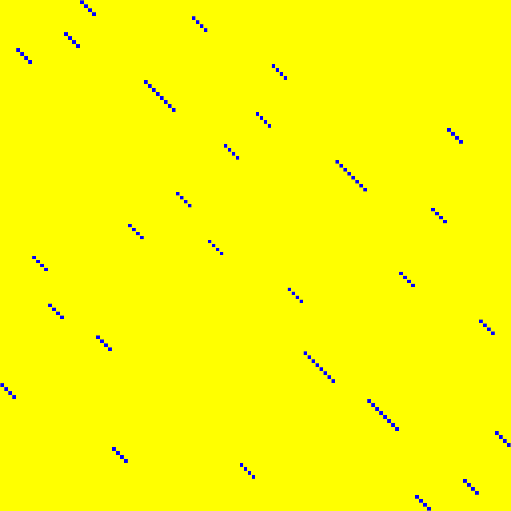
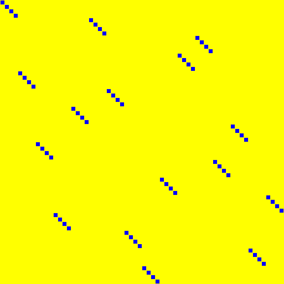

# Bit-permutations

Source data: [`permutations.yaml`](permutations.yaml).

Entry count: 40.

| Key | Preview | Shape | Year | Properties | Origin |
|:----|:-------:|:-----:|:----:|:-----------|:-------|
| **AES.SHIFTROWS** AES, ShiftRows also known as `AES.SHIFTROW` |  | 128 | 1998, 2001 | order = 4 | [link](https://csrc.nist.gov/pubs/fips/197/final) |
| **AETHER.PN** AETHER, Pₙ |  | 128 | 2025 | order = 5 | [link](https://tches.iacr.org/index.php/TCHES/article/view/12228) |
| **BAKSHEESH.P** BAKSHEESH, PLayer |  | 128 | 2026 | order = 310 | [link](https://cic.iacr.org/p/2/4/31) |
| **BEANIE.SR** BEANIE, ShiftRows |  | 32 | 2025 | involution, order = 2 | [link](https://tosc.iacr.org/index.php/ToSC) |
| **BLINK.P128** Blink, P |  | 128 | 2025 | order = 66 | [link](https://tosc.iacr.org/index.php/ToSC/article/view/12613) |
| **BLINK.P64** Blink, P |  | 64 | 2025 | order = 4 | [link](https://tosc.iacr.org/index.php/ToSC/article/view/12613) |
| **DEOXYS.H** Deoxys-TBC, h |  | 128 | 2021 | order = 8 | [link](https://doi.org/10.1007/s00145-021-09397-w) |
| **DIALGA.P0** Dialga, π₀ |  | 128 | 2025 | order = 8 | [link](https://tosc.iacr.org/index.php/ToSC) |
| **DIALGA.P1** Dialga, π₁ |  | 128 | 2025 | order = 8 | [link](https://tosc.iacr.org/index.php/ToSC) |
| **DIALGA.P2** Dialga, π₂ |  | 128 | 2025 | order = 8 | [link](https://tosc.iacr.org/index.php/ToSC) |
| **DIALGA.P3** Dialga, π₃ |  | 128 | 2025 | order = 4 | [link](https://tosc.iacr.org/index.php/ToSC) |
| **DIALGA.PM** Dialga, πₘ |  | 128 | 2025 | order = 4 | [link](https://tosc.iacr.org/index.php/ToSC) |
| **GIFT.128** GIFT, GIFT-128 bit permutation |  | 128 | 2017 | order = 310 | [link](https://eprint.iacr.org/2017/622) |
| **GIFT.64** GIFT, GIFT-64 bit permutation |  | 64 | 2017 | order = 4 | [link](https://eprint.iacr.org/2017/622) |
| **GIMLI.BIGSWAP** Gimli, Big-Swap |  | 384 | 2017 | involution, order = 2 | [link](https://gimli.cr.yp.to/gimli-20170627.pdf) |
| **GIMLI.SMALLSWAP** Gimli, Small-Swap |  | 384 | 2017 | involution, order = 2 | [link](https://gimli.cr.yp.to/gimli-20170627.pdf) |
| **GLEEOK.PI128B1** Gleeok-128, π₁ |  | 128 | 2024 | order = 32 | [link](https://tches.iacr.org/index.php/TCHES) |
| **GLEEOK.PI128B2** Gleeok-128, π₂ |  | 128 | 2024 | order = 32 | [link](https://tches.iacr.org/index.php/TCHES) |
| **GLEEOK.PI128B3** Gleeok-128, π₃ |  | 128 | 2024 | order = 32 | [link](https://tches.iacr.org/index.php/TCHES) |
| **GLEEOK.PI256B1** Gleeok-256, π₁ |  | 256 | 2024 | order = 64 | [link](https://tches.iacr.org/index.php/TCHES) |
| **GLEEOK.PI256B2** Gleeok-256, π₂ |  | 256 | 2024 | order = 64 | [link](https://tches.iacr.org/index.php/TCHES) |
| **GLEEOK.PI256B3** Gleeok-256, π₃ |  | 256 | 2024 | order = 32 | [link](https://tches.iacr.org/index.php/TCHES) |
| **JOLTIK.H** Joltik, h |  | 64 | 2014 | order = 8 | [link](https://competitions.cr.yp.to/round2/joltikv13.pdf) |
| **KLEIN.ROTATENIBBLES** KLEIN, RotateNibbles |  | 64 | 2011 | order = 4 | [link](https://doi.org/10.1007/978-3-642-25286-0_1) |
| **MERIDIAN.MER** MERIDIAN, Mer |  | 128 | 2026 | order = 4 | [link](https://eprint.iacr.org/2026/856) |
| **MERIDIAN.PAR** MERIDIAN, Par |  | 128 | 2026 | order = 4 | [link](https://eprint.iacr.org/2026/856) |
| **PIPO.R** PIPO, R-layer |  | 64 | 2020 | order = 8 | [link](https://doi.org/10.1007/978-3-030-68890-5_6) |
| **PRESENT** PRESENT, pLayer |  | 64 | 2007 | order = 3 | [link](https://link.springer.com/chapter/10.1007/978-3-540-74735-2_31) |
| **SALSA20.TRANSPOSE** Salsa20, transpose |  | 512 | 2008 | involution, order = 2 | [link](https://cr.yp.to/snuffle/spec.pdf) |
| **SAND.P32** SAND, P₃₂ |  | 32 | 2022 | order = 8 | [link](https://doi.org/10.1007/s10623-022-01008-4) |
| **SAND.P64** SAND, P₆₄ |  | 64 | 2022 | order = 8 | [link](https://doi.org/10.1007/s10623-022-01008-4) |
| **SCARF.PI** SCARF, π |  | 60 | 2023 | order = 29 | [link](https://www.usenix.org/conference/usenixsecurity23/presentation/canale) |
| **SEFA.P16** SEFA, bitPermLayer |  | 16 | 2026 | involution, order = 2 | [link](https://eprint.iacr.org/2026/897) |
| **SPEEDY.SC** SPEEDY, ShiftColumns |  | 192 | 2021 | order = 32 | [link](https://tches.iacr.org/index.php/TCHES/article/view/9074) |
| **TRIFLE** TRIFLE-BC |  | 128 | 2019 | order = 7 | [link](https://csrc.nist.gov/CSRC/media/Projects/lightweight-cryptography/documents/round-1/spec-doc/trifle-spec.pdf) |
| **TWINKLE.LANEROTATION0** Twinkle, LaneRotation₀ |  | 1280 | 2024 | order = 80 | [link](https://cic.iacr.org/) |
| **TWINKLE.LANEROTATION1** Twinkle, LaneRotation₁ |  | 1280 | 2024 | order = 80 | [link](https://cic.iacr.org/) |
| **ULBC.POSPERM** uLBC, PosPerm |  | 128 | 2024 | order = 4 | [link](https://cic.iacr.org/p/1/4/25) |
| **VISTRUTAH.ZETA256** Vistrutah-256, ζ |  | 256 | 2025 | order = 5 | [link](https://tosc.iacr.org/index.php/ToSC/article/view/12467) |
| **VISTRUTAH.ZETA512** Vistrutah-512, ζ |  | 512 | 2025 | order = 6 | [link](https://tosc.iacr.org/index.php/ToSC/article/view/12467) |

