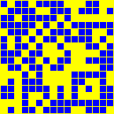
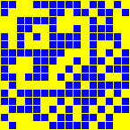
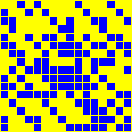
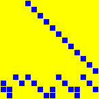
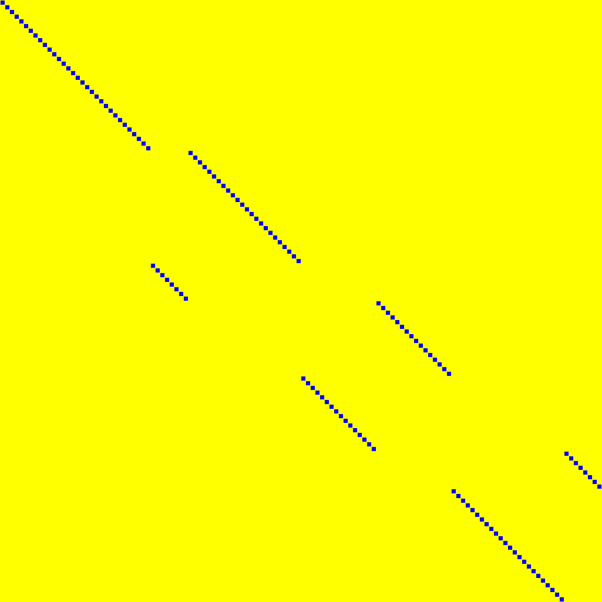
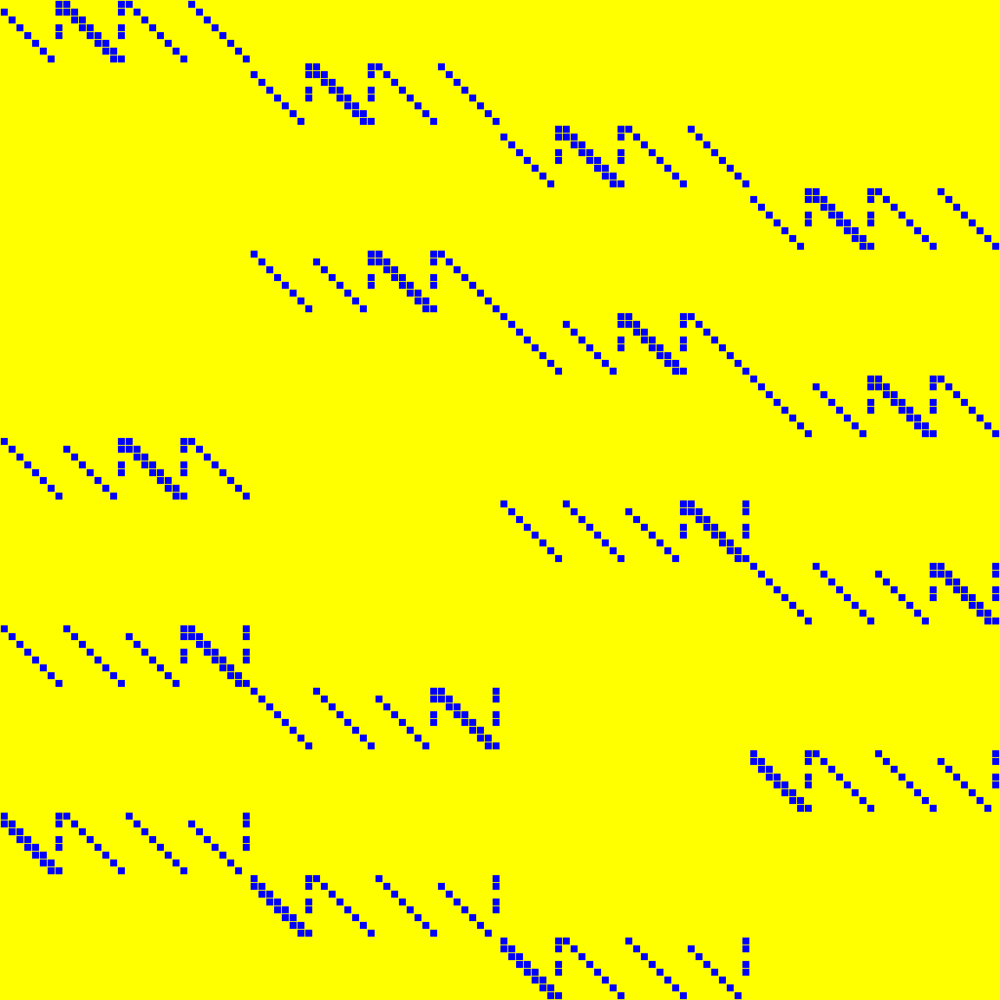

# Visualisation

One render per entry, in the colour scheme of the [`linear-layers`](https://github.com/Daemen-Crypto/linear-layers) repository: a cell of value $0$ is yellow, a cell of value $1$ is blue. A bit-permutation $P$ of size $N$ is drawn as the $N \times N$ matrix $M$ with $M[P[i]][i] = 1$. Every entry is described in the YAML file its heading links to.

## [Matrices, 16bit](16bit.md)

| &nbsp; | &nbsp; | &nbsp; | &nbsp; |
|:---:|:---:|:---:|:---:|
|  **AETHER.MB** 16 &times; 16 |  **ARIA** 16 &times; 16 |  **BKD21.A** 16 &times; 16 |  **BKD21.B** 16 &times; 16 |
|  **BKL16.S16** 16 &times; 16 |  **CHAM.RF1** 16 &times; 16 |  **CHAM.RF2** 16 &times; 16 |  **DL18C** 16 &times; 16 |
|  **GF16.ECCSQR** 16 &times; 16 |  **GF16.SQR** 16 &times; 16 |  **GF4.SQR** 4 &times; 4 |  **GF8.ECCSQR** 8 &times; 8 |
|  **GF8.SQR** 8 &times; 8 |  **JOLTIK** 16 &times; 16 |  **JPST17.IS16** 16 &times; 16 |  **JPST17.S16** 16 &times; 16 |
|  **KLSW17.S16** 16 &times; 16 |  **LED.MIXCOLUMNS** 16 &times; 16 |  **LED.MIXCOLUMNSSERIAL** 16 &times; 16 |  **LS16.S16** 16 &times; 16 |
|  **LW16.A16** 16 &times; 16 |  **LW16.B16** 16 &times; 16 |  **LW16.I16** 16 &times; 16 |  **MIDORI** 16 &times; 16 |
|  **PRIDE.L0** 16 &times; 16 |  **PRIDE.L1** 16 &times; 16 |  **PRIDE.L2** 16 &times; 16 |  **PRIDE.L3** 16 &times; 16 |
|  **PRINCE.M0** 16 &times; 16 |  **PRINCE.M1** 16 &times; 16 |  **QARMA.S64** 16 &times; 16 |  **SKINNY** 16 &times; 16 |
|  **SKOP15.S16** 16 &times; 16 |  **SMALLSCALEAES** 16 &times; 16 |  **SS16.IS16** 16 &times; 16 |  **SS16.S16** 16 &times; 16 |
|  **TWINKLE.MIXSLICE** 16 &times; 16 | &nbsp; | &nbsp; | &nbsp; |

## [Matrices, 32bit](32bit.md)

| &nbsp; | &nbsp; | &nbsp; | &nbsp; |
|:---:|:---:|:---:|:---:|
|  **AES.MIXCOLUMN** 32 &times; 32 |  **ANUBIS** 32 &times; 32 |  **BKL16.S32** 32 &times; 32 |  **CHAM.KS1** 32 &times; 32 |
|  **CHAM.KS2** 32 &times; 32 |  **CLEFIA.M0** 32 &times; 32 |  **CLEFIA.M1** 32 &times; 32 |  **DIALGA** 32 &times; 32 |
|  **DL18A** 32 &times; 32 |  **DL18B** 32 &times; 32 |  **FOX.MU4** 32 &times; 32 |  **GF32.SQR** 32 &times; 32 |
|  **ICEPOLE.SLICE** 20 &times; 20 |  **JPST17.IS32** 32 &times; 32 |  **JPST17.S32** 32 &times; 32 |  **KLSW17.IS32** 32 &times; 32 |
|  **KLSW17.IS8_32** 32 &times; 32 |  **KLSW17.S32** 32 &times; 32 |  **KLSW17.S8_32** 32 &times; 32 |  **LS16.S32** 32 &times; 32 |
|  **LW16.A32** 32 &times; 32 |  **LW16.B32** 32 &times; 32 |  **LW16.IA32** 32 &times; 32 |  **LW16.IB32** 32 &times; 32 |
|  **PYJAMASK.M0** 32 &times; 32 |  **PYJAMASK.M1** 32 &times; 32 |  **PYJAMASK.M2** 32 &times; 32 |  **PYJAMASK.M3** 32 &times; 32 |
|  **PYJAMASK.MK** 32 &times; 32 |  **QARMA.S128** 32 &times; 32 |  **SHA2.BIGSIGMA0** 32 &times; 32 |  **SHA2.BIGSIGMA1** 32 &times; 32 |
|  **SHA2.SMALLSIGMA0** 32 &times; 32 |  **SHA2.SMALLSIGMA1** 32 &times; 32 |  **SKOP15.IS4_32** 32 &times; 32 |  **SKOP15.IS8_32** 32 &times; 32 |
|  **SKOP15.S4_32** 32 &times; 32 |  **SKOP15.S8_32** 32 &times; 32 |  **SM4** 32 &times; 32 |  **SS16.IS32** 32 &times; 32 |
|  **SS16.S32** 32 &times; 32 |  **SS17.S32** 32 &times; 32 |  **TWOFISH** 32 &times; 32 |  **WHIRLWIND.M0** 32 &times; 32 |
|  **WHIRLWIND.M1** 32 &times; 32 |  **ZUC.L1** 32 &times; 32 |  **ZUC.L2** 32 &times; 32 | &nbsp; |

## [Matrices, 64bit](64bit.md)

| &nbsp; | &nbsp; | &nbsp; | &nbsp; |
|:---:|:---:|:---:|:---:|
|  **ASCON.SIGMA0** 64 &times; 64 |  **ASCON.SIGMA1** 64 &times; 64 |  **ASCON.SIGMA2** 64 &times; 64 |  **ASCON.SIGMA3** 64 &times; 64 |
|  **ASCON.SIGMA4** 64 &times; 64 |  **BKL16.S64** 64 &times; 64 |  **FOX.MU8** 64 &times; 64 |  **GF64.SQR** 64 &times; 64 |
|  **GROESTL** 64 &times; 64 |  **JPST17.IS64** 64 &times; 64 |  **KHAZAD** 64 &times; 64 |  **KLSW17.IS64** 64 &times; 64 |
|  **KLSW17.S64** 64 &times; 64 |  **LS16.S64** 64 &times; 64 |  **SCARF.SIGMA** 60 &times; 60 |  **SKOP15.IS64** 64 &times; 64 |
|  **SKOP15.S64** 64 &times; 64 |  **SPOOK.LBOX** 64 &times; 64 |  **SS17.S64** 64 &times; 64 |  **WHIRLPOOL** 64 &times; 64 |

## [Matrices, 128bit](128bit.md)

| &nbsp; | &nbsp; | &nbsp; | &nbsp; |
|:---:|:---:|:---:|:---:|
|  **AES.SHIFTROW** 128 &times; 128 |  **AES.SHIFTROWMIXCOLUMN** 128 &times; 128 |  **ARIA.128** 128 &times; 128 |  **BAKSHEESH.T** 128 &times; 128 |
|  **GF127.SQR** 127 &times; 127 |  **GF128.SQR** 128 &times; 128 |  **GLEEOK.THETA128B1** 128 &times; 128 |  **GLEEOK.THETA128B2** 128 &times; 128 |
|  **GLEEOK.THETA128B3** 128 &times; 128 |  **SPOOK.DBOX** 128 &times; 128 | &nbsp; | &nbsp; |

## [Matrices, 256bit](256bit.md)

| &nbsp; | &nbsp; | &nbsp; | &nbsp; |
|:---:|:---:|:---:|:---:|
|  **GF163.ECCSQR** 163 &times; 163 |  **GF163.SQR** 163 &times; 163 |  **GF233.ECCSQR** 233 &times; 233 |  **GF233.SQR** 233 &times; 233 |
|  **GF256.SQR** 256 &times; 256 |  **GLEEOK.THETA256B1** 256 &times; 256 |  **GLEEOK.THETA256B2** 256 &times; 256 |  **GLEEOK.THETA256B3** 256 &times; 256 |

## [Matrices, 283bit](283bit.md)

| &nbsp; | &nbsp; | &nbsp; | &nbsp; |
|:---:|:---:|:---:|:---:|
|  **GF283.ECCSQR** 283 &times; 283 |  **GF283.SQR** 283 &times; 283 | &nbsp; | &nbsp; |

## [Matrices, 320bit](320bit.md)

| &nbsp; | &nbsp; | &nbsp; | &nbsp; |
|:---:|:---:|:---:|:---:|
|  **ASCON** 320 &times; 320 | &nbsp; | &nbsp; | &nbsp; |

## [Matrices, 571bit](571bit.md)

| &nbsp; | &nbsp; | &nbsp; | &nbsp; |
|:---:|:---:|:---:|:---:|
|  **GF571.ECCSQR** 571 &times; 571 |  **GF571.SQR** 571 &times; 571 | &nbsp; | &nbsp; |

## [Matrices, 1024bit](1024bit.md)

| &nbsp; | &nbsp; | &nbsp; | &nbsp; |
|:---:|:---:|:---:|:---:|
|  **GF1024.SQR** 1024 &times; 1024 | &nbsp; | &nbsp; | &nbsp; |

## [Matrices, 1600bit](1600bit.md)

| &nbsp; | &nbsp; | &nbsp; | &nbsp; |
|:---:|:---:|:---:|:---:|
|  **SHA3** 1600 &times; 1600 | &nbsp; | &nbsp; | &nbsp; |

## [Rectangular matrices, 16bit](rectangular16bit.md)

| &nbsp; | &nbsp; | &nbsp; | &nbsp; |
|:---:|:---:|:---:|:---:|
|  **GF4.MUL** 4 &times; 7 |  **GF8.MUL** 8 &times; 15 | &nbsp; | &nbsp; |

## [Rectangular matrices, 32bit](rectangular32bit.md)

| &nbsp; | &nbsp; | &nbsp; | &nbsp; |
|:---:|:---:|:---:|:---:|
|  **GF16.MUL** 16 &times; 31 | &nbsp; | &nbsp; | &nbsp; |

## [Rectangular matrices, 64bit](rectangular64bit.md)

| &nbsp; | &nbsp; | &nbsp; | &nbsp; |
|:---:|:---:|:---:|:---:|
|  **GF32.MUL** 32 &times; 63 | &nbsp; | &nbsp; | &nbsp; |

## [Rectangular matrices, 128bit](rectangular128bit.md)

| &nbsp; | &nbsp; | &nbsp; | &nbsp; |
|:---:|:---:|:---:|:---:|
|  **GF64.MUL** 64 &times; 127 | &nbsp; | &nbsp; | &nbsp; |

## [Rectangular matrices, 256bit](rectangular256bit.md)

| &nbsp; | &nbsp; | &nbsp; | &nbsp; |
|:---:|:---:|:---:|:---:|
|  **GF127.MUL** 127 &times; 253 |  **GF128.MUL** 128 &times; 255 | &nbsp; | &nbsp; |

## [Rectangular matrices, 325bit](rectangular325bit.md)

| &nbsp; | &nbsp; | &nbsp; | &nbsp; |
|:---:|:---:|:---:|:---:|
|  **GF163.MUL** 163 &times; 325 | &nbsp; | &nbsp; | &nbsp; |

## [Rectangular matrices, 465bit](rectangular465bit.md)

| &nbsp; | &nbsp; | &nbsp; | &nbsp; |
|:---:|:---:|:---:|:---:|
|  **GF233.MUL** 233 &times; 465 | &nbsp; | &nbsp; | &nbsp; |

## [Rectangular matrices, 511bit](rectangular511bit.md)

| &nbsp; | &nbsp; | &nbsp; | &nbsp; |
|:---:|:---:|:---:|:---:|
|  **GF256.MUL** 256 &times; 511 | &nbsp; | &nbsp; | &nbsp; |

## [Rectangular matrices, 565bit](rectangular565bit.md)

| &nbsp; | &nbsp; | &nbsp; | &nbsp; |
|:---:|:---:|:---:|:---:|
|  **GF283.MUL** 283 &times; 565 | &nbsp; | &nbsp; | &nbsp; |

## [Rectangular matrices, 1141bit](rectangular1141bit.md)

| &nbsp; | &nbsp; | &nbsp; | &nbsp; |
|:---:|:---:|:---:|:---:|
|  **GF571.MUL** 571 &times; 1141 | &nbsp; | &nbsp; | &nbsp; |

## [Rectangular matrices, 2047bit](rectangular2047bit.md)

| &nbsp; | &nbsp; | &nbsp; | &nbsp; |
|:---:|:---:|:---:|:---:|
|  **GF1024.MUL** 1024 &times; 2047 | &nbsp; | &nbsp; | &nbsp; |

## [Bit-permutations](permutations.md)

| &nbsp; | &nbsp; | &nbsp; | &nbsp; |
|:---:|:---:|:---:|:---:|
|  **AETHER.PN** 128 &times; 128 |  **BAKSHEESH.P** 128 &times; 128 |  **BEANIE.SR** 32 &times; 32 |  **DIALGA.P0** 128 &times; 128 |
|  **DIALGA.P1** 128 &times; 128 |  **DIALGA.P2** 128 &times; 128 |  **DIALGA.P3** 128 &times; 128 |  **DIALGA.PM** 128 &times; 128 |
|  **GIFT.128** 128 &times; 128 |  **GIFT.64** 64 &times; 64 |  **GLEEOK.PI128B1** 128 &times; 128 |  **GLEEOK.PI128B2** 128 &times; 128 |
|  **GLEEOK.PI128B3** 128 &times; 128 |  **GLEEOK.PI256B1** 256 &times; 256 |  **GLEEOK.PI256B2** 256 &times; 256 |  **GLEEOK.PI256B3** 256 &times; 256 |
|  **PRESENT** 64 &times; 64 |  **SCARF.PI** 60 &times; 60 |  **TRIFLE** 128 &times; 128 |  **TWINKLE.LANEROTATION0** 1280 &times; 1280 |
|  **TWINKLE.LANEROTATION1** 1280 &times; 1280 | &nbsp; | &nbsp; | &nbsp; |

## Keys no longer carrying a body

A matrix that turned out to be catalogued twice is kept once. The key that lost its body is listed here so that a reference to it can still be followed.

| Key | Now read as | Why |
|:----|:------------|:----|
| `SKOP15.IS16` | `JOLTIK` | Retired: the same matrix, byte for byte, and Joltik (2014) is the earlier publication; the key is retired rather than kept as a second copy |
| `MIDORI` | `PRIDE.L0` | Alias entry: the same matrix; PRIDE (2014) is earlier and the Midori specification attaches no citation to it, so Midori is listed under `reuse` on that entry |
